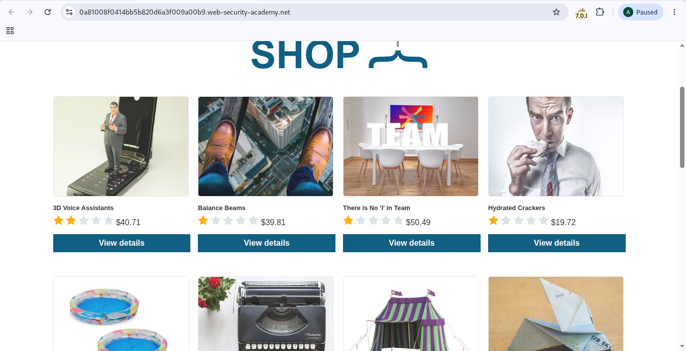
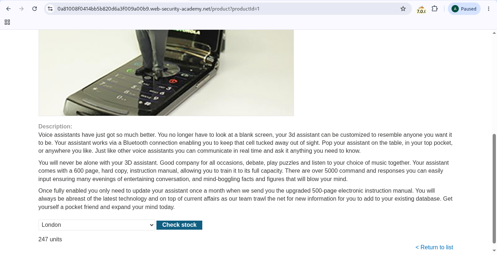
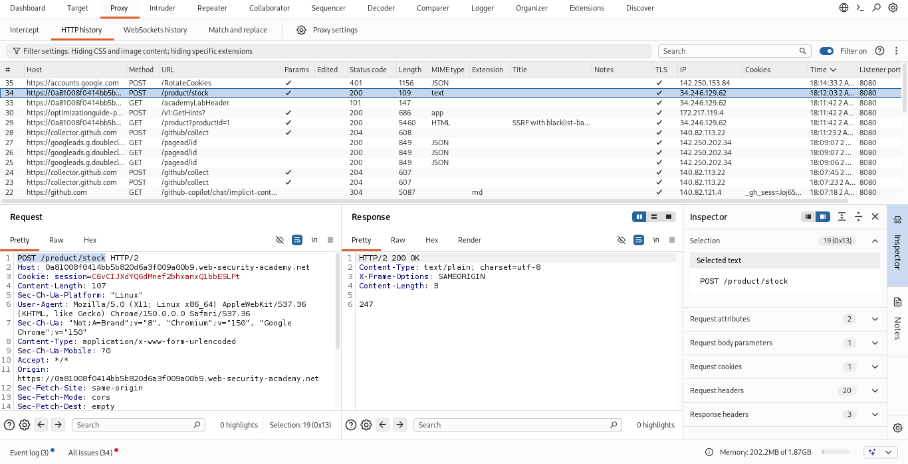
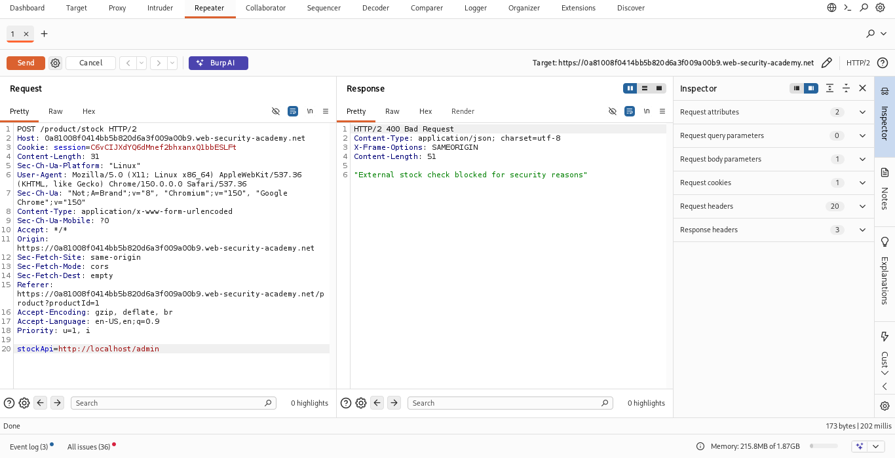
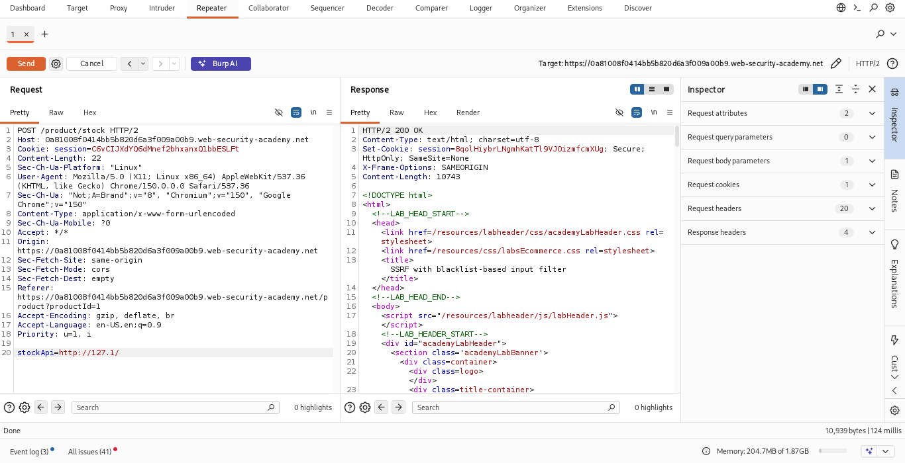
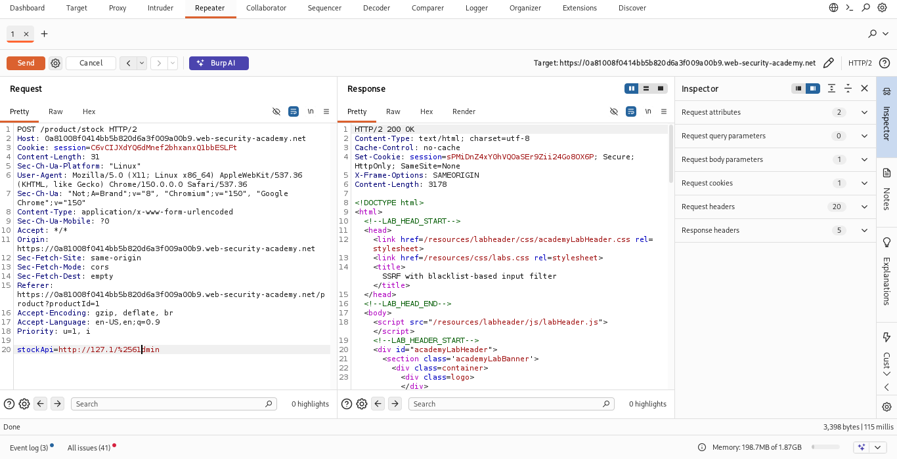
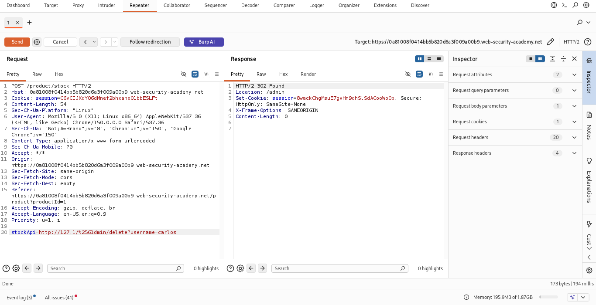
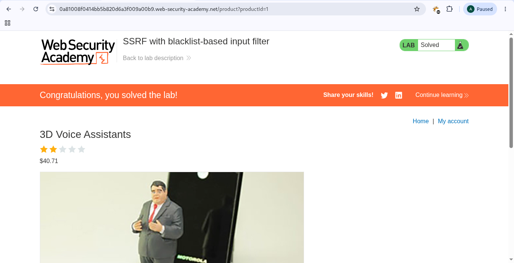

# SSRF with blacklist-based input filter

## Platform

PortSwigger Web Security Academy

## Difficulty

Practitioner

## Category

Server-side request forgery

## Lab over-view
 
We Are told that the lab has a stock check feature which fetches data from an internal system. And to solve the lab we have to access the admin interface and delete the user carlos.

# Steps To soleve The Lab

1, Click "View details" to one of the productes

2, Go to the bottom and click "Check stock"

3, Look for "POST /product/stock" in your Burpsuite and send it to repeater.

4, Change the stockApi to "http://localhost/admin" and check if it works

5, The above step doesn't work so change the stockApi to "http://127.1/" check if it is not blocked.

6, change the stockApi to "http://127.1/admin" and try to access the admin page

7, Encode the letter "a" twice and try to access the admn page again.

8, check the url to delete carlos and use it in stockApi.

9, Return to your lab and see that we have deleted carlos and solved the lab.
